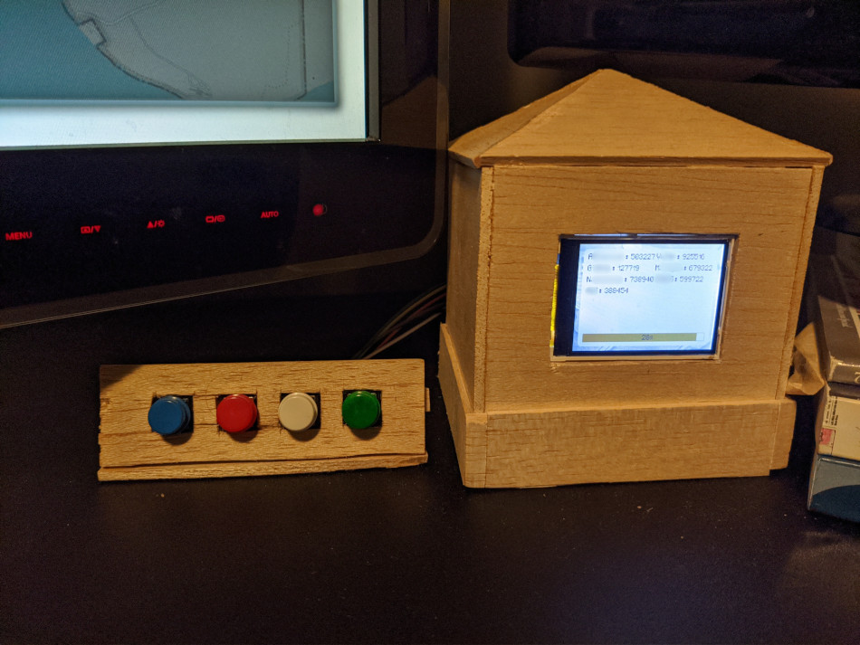

# desk-otp

Desktop one-time password widget designed for Raspberry Pi + 320x240 framebuffer-enabled LCD. Encrypts OTP keys with PIN sequence entered via GPIO buttons.

## Build/Installation

Install OpenSSL & libgpiod dev libraries.

Checkout [dotp](https://github.com/djandries/dotp) and [fbmagic](https://github.com/djandries/fbmagic) in the parent directory, run `make` in both folders.

GPIO pins 26, 16, 6, 5 are mapped to digits 1, 2, 3, 4, respectively, by default. To change this mapping, add the GPIO_PINS environment variable to `/etc/systemd/system/desk-otp.service`: `Environment="GPIO_PINS=<comma separated list of pins>"`. Up to nine digits can be mapped.

Run `make` and `sudo make install`.

Modify `/etc/desk-otp-keys.conf`, add a line for each key. The format for each line should be `<base32 OTP key>:<label>`. Restart the desk-otp service.

Enter in a PIN sequence for the first time. The OTP screen should appear on the LCD. The OTP keys in `/etc/desk-otp-keys.conf` will be encrypted.

Every time the correct sequence is entered, the OTP screen will be shown for a short amount of time.